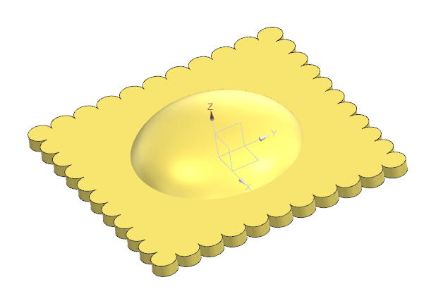
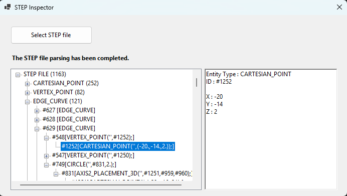

# STEP Inspector

STEP Inspector is a lightweight CAD data exploration tool for STEP (*.stp, *.step) files. 
The goal of this project is to understand how CAD geometry and topology are represented inside STEP files and to gradually build a bridge between STEP entities and a custom geometry kernel.

### Current features:
- Open STEP files
- Entity counting
- Entity hierarchy browser
- Entity reference viewer
- Raw STEP entity inspection
- CARTESIAN_POINT parsing

### Example:
 
```text
STEP FILE "Ravioli"
 ├── CARTESIAN_POINT
 │    ├── #1245=CARTESIAN_POINT('',(0.,0.,0.));
 │    ├── #1246=CARTESIAN_POINT('',(-20.,-16.,0.));
 │    └── ...
 ├── VERTEX_POINT
 │    ├── #545=VERTEX_POINT('',#1247);
 │    │      └── #1247=CARTESIAN_POINT('',(-20.,-14.,0.));
 │    ├── #546=VERTEX_POINT('',#1248);
 │    │      └── #1248=CARTESIAN_POINT('',(-20.,-18.,0.));
 │    └── ...
 ├── EDGE_CURVE
 │    ├── #627=EDGE_CURVE('',#545,#546,#748,.T.);
 │    │       ├── #545=VERTEX_POINT('',#1247);
 │    │       ├── #546=VERTEX_POINT('',#1248);
 │    │       └── #748=CIRCLE('',#830,2.);
 │    └── ...
 ├── ADVANCED_FACE
 │    ├── #52=ADVANCED_FACE('',(#136),#96,.T.);
 │    │       ├── #136=FACE_OUTER_BOUND('',#179,.T.);
 │    │       └── #96=CYLINDRICAL_SURFACE('',#832,2.);
 │    └── ...
 ├── MANIFOLD_SOLID_BREP
 │    ├── #45=MANIFOLD_SOLID_BREP('',#47);
 │    │       └── #47=CLOSED_SHELL('',(#52,#53,#54,#55,#56,#57,#58,#59,#60,#61,#62,#63,#64));
 │    └── ...
 └── ...
```

### UI:
 

### Supported Entity Types:
- You can add or remove entity types in the file: ``` @Schemas/Custom.txt ```
- Lists of available entities for AP203, AP214, and AP242 will be available soon.

### Currently Listed Entity Types (Default):
```text
CARTESIAN_POINT
VERTEX_POINT
EDGE_CURVE
EDGE_LOOP
ADVANCED_FACE
MANIFOLD_SOLID_BREP
LINE
VECTOR
CIRCLE
ELLIPSE
CURVE
PLANE
CLOSED_SHELL
FACE_BOUND
FACE_OUTER_BOUND
ORIENTED_EDGE
AXIS2_PLACEMENT_3D
B_SPLINE_CURVE
B_SPLINE_CURVE_WITH_KNOTS
B_SPLINE_SURFACE
B_SPLINE_SURFACE_WITH_KNOTS
RATIONAL_B_SPLINE_SURFACE
CYLINDRICAL_SURFACE
CONICAL_SURFACE
TOROIDAL_SURFACE
```


🚧 **Work in Progress** 🚧

### Planned features:
- Vertex / Edge / Face construction
- B-Rep graph visualization
- STEP geometry explorer
- Wireframe viewer
